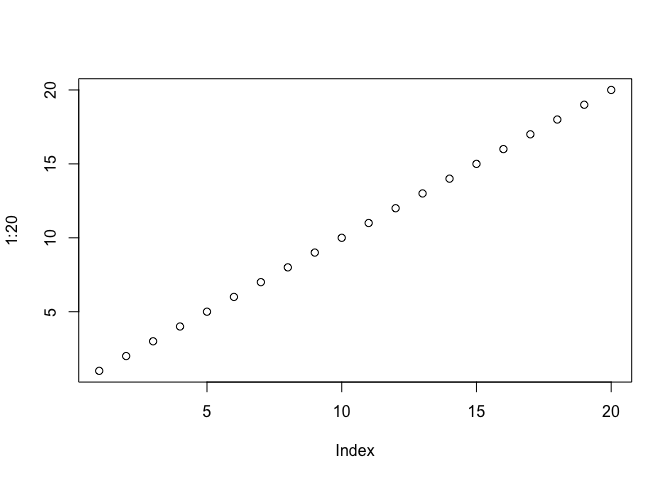

Data-Driven Answers
1. Democratic Nomination (https://projects.fivethirtyeight.com/2020-primary-forecast/)
  This visualization is very interesting. It seems to go along with our reading for the week of utilizing a series of lines instead of stacking bars or using a pie chart. The charts have solid visuals with custom graphics that very clearly show what, or who, each line represents. There is a very good key that shows clearly what the visualization is trying to tell us. The only bad thing about these graphics is that they have a "No One" item, whcih is unused and takes up unnecessary space.
  
2. The Rising Demand for Data Scientists (https://priceonomics.com/survey-which-data-skills-do-you-need-to-get-ahead/)
  This chart shows some time-driven data. It is identifying the number of job postings in data science per 1,000,000 job postings on indeed. The graph is a simple line that shows a definite trend. I think it's awesome that the creator scaled so that the line was showing and average slope of 45 degrees- this helps us visualize any change more efficiently. I also liked that there were no frills. It was a very easy, clear chart. One thing I didn't like is that it was kind of hard to tell at first what they were telling me. The caveat that the numbers on the chart were per 1,000,000 job postings seemed to hide from me and confused me. 
  
3. How Unpopular is Donald Trump? (https://projects.fivethirtyeight.com/trump-approval-ratings/?ex_cid=rrpromo)
  This diagram shows trumps approval vs. disapproval ratings over his term as president. One thing I really like about this diagram is that is uses the contrasting colors in different saturations to show the different data points that are taken to show the trend line. I also appreciate how I can hover over the graphic and see the exact number in the given month. One final thing I like about this graphic is how it has a list of all the polls that are used to make up the data at the bottom. One thing I didn't like was that I couldn't quite understand how the Y-axis of the chart corresponded to the overall data. If 53% of people, approve for example, doesn't that mean that 47% naturally disapprove? It seemed like the two lines were almost more confusing after I stared at it long enough.

4. Where Home Prices Are Rising Fastest in America (https://priceonomics.com/where-home-prices-are-rising-the-fastest-slowest/)
  These graphics, though they utilized a very standard w3schools-esque theme, provided some good data. They showed the percent of price change, on average, for the housing market in all of the states in America. They used a bar chart that allowed the user to see and compare the size of the bars, thereby manifesting more quickly the meaning of the data. Another good thing about these charts was that they all started from zero and had the same base-aslignment. This allowed the users to more accurately see the size and there was no deception. One thing this chart could improve is, perhaps, to spice it up a bit. It seemed a bit boring and I wasn't really interested in looking at the chart compared to the ones I reviewed before it. 


```r
plot(1:20)
```

<!-- -->

[x] Find 4-5 examples of data-driven answers and write a one-paragraph review of each.
  [x] List 2-3 items that are unique/good
  [x] Identify 1 issue with the each example
[x] Create an .Rmd file in R-Studio
  [x] Title it Case Study 1 in the YAML
  [x] Include links to the visualization post you found
  [x] Write a one paragraph critique of each visualization
  [x] Add the R code below to your .Rmd file
  [x] Knit the file to .html and keep the .md file as well
[x] Create an account on slack. You might create a catchy username that matches your other social media usernames and that can follow you for your career. Mine is hathawayj.
  [x] Upload your intermediary .md file to the general channel in our Slack group
