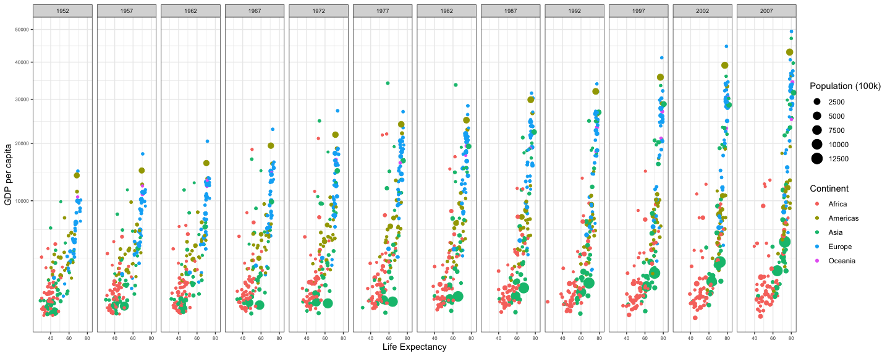
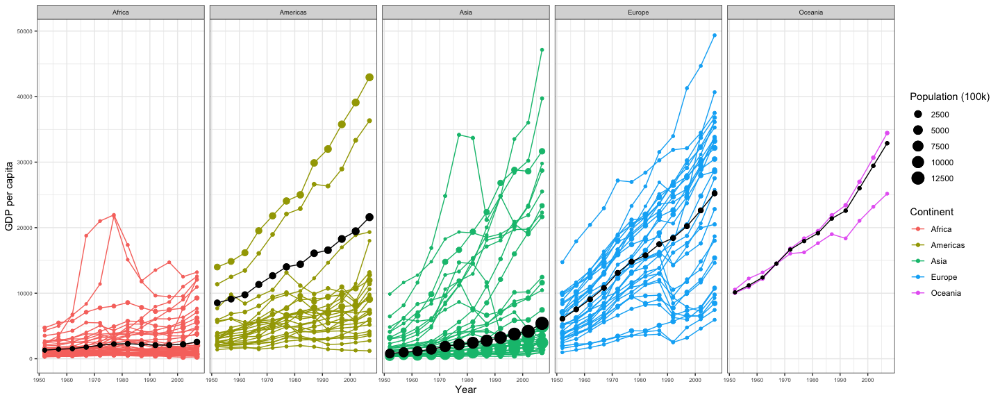

```r
# Use this R-Chunk to import all your datasets!
library(gapminder)
```

## Background

Hans Rosling is one of the most popular data scientists on the web. His original TED talk was very popular among my friends when it came out. We are going to create some graphics using his formatted data as our weekly case study. Note that we need to remove Kuwait from the data (discussion on this)

## Data Wrangling


```r
# Use this R-Chunk to clean & wrangle your data!
# "...we need to remove Kuwait from the data..."
dat <- subset(gapminder, country != "Kuwait")
View(dat)
```

## Data Visualization


```r
# Use this R-Chunk to plot & visualize your data!
dat %>%
  ggplot(aes(lifeExp, gdpPercap)) +
  geom_point(aes(size = pop / 100000, color = continent)) +
  facet_wrap(~ year, nrow = 1) + 
  labs(colour = "Continent", size = "Population (100k)") + 
  xlab("Life Expectancy") + ylab("GDP per capita") + 
  theme_bw() + 
  theme(axis.text = element_text(size = 6), strip.text.x = element_text(size = 7)) +
  scale_y_continuous(trans = "sqrt")
```

<!-- -->

```r
ggsave("cs2.1.png", plot = last_plot(), width = 15, units = c("in"))
```


```r
# Use this R-Chunk to plot & visualize your data!
avg <- dat %>%
  group_by(year, continent) %>%
  mutate(gdpPercap = weighted.mean(gdpPercap, pop / 100000))

dat %>%
  ggplot(aes(year, gdpPercap, color = continent)) +
  geom_line(aes(group = country)) + 
  geom_point(aes(size = pop / 100000, color = continent)) +
  geom_line(data = avg, color = "black") +
  geom_point(data = avg, aes(size = pop / 100000), color = "black") +
  facet_wrap(~ continent, nrow = 1) +
  labs(colour = "Continent", size = "Population (100k)") + 
  xlab("Year") + ylab("GDP per capita") + 
  theme_bw() + 
  theme(axis.text = element_text(size = 6), strip.text.x = element_text(size = 7))
```

<!-- -->

```r
ggsave("cs2.2.png", plot = last_plot(), width = 15, units = c("in"))
```

## Conclusions

Taking the average of something can really be innacurate Sure, the average represented the continent's GDP, but each country had a tremendous amount of variation. The GDP in the americas was vastly different, with the US and Canada as strong outliers. We can't use the average as a representation of the whole!

## Task list

[x] Recreate the two graphics shown below using gapminder dataset from library(gapminder) (get them to match as closely as you can)
  [x] Use library(tidyverse) to load ggplot2 and dplyr and the theme_bw() to duplicate the first plot
  [x] Use scale_y_continuous(trans = "sqrt") to get the correct scale on the y-axis.
  [x] Build weighted average data set using weighted.mean() and GDP with summarise() and group_by() that will be the black continent average line on the second plot
  [x] Use theme_bw() to duplicate the second plot. You will need to use the new data to make the black lines and dots showing the continent average.
  [x] Use ggsave() and save each plot as a .png with a width of 15 inches
[x] Build an Rmd file that has the following features
  [x] The title is the same as listed in the task
  [x] You have two sections – 1) Background, 2) Images
  [x] In the background section write a few sentences about what you learned making these plots
  [x] In the Image section have two chunks. One for each image
[x] Save your .Rmd, .md, and the two .png’s of the plots into your git repository.
