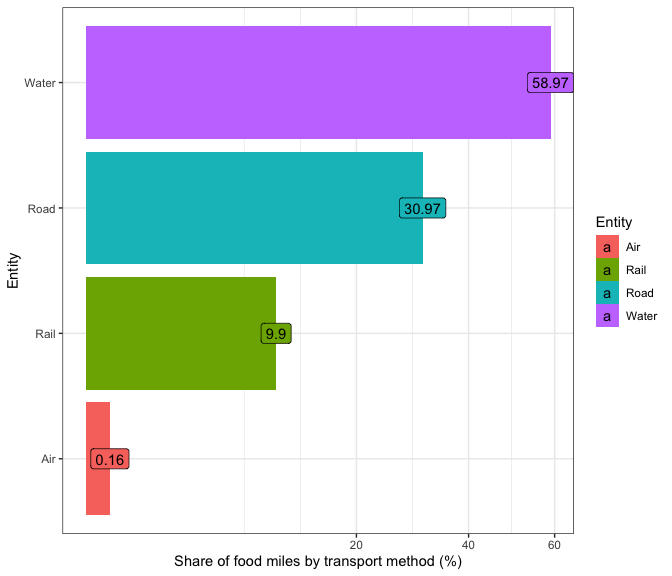
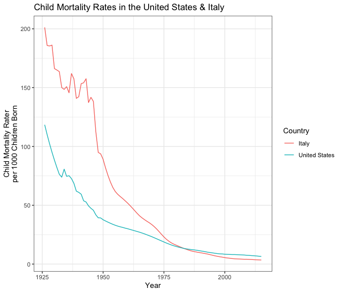

```r
# Use this R-Chunk to import all your datasets!
setwd("/Users/CritterWilson/Documents/BYU-I/Software Engineering/MATH335/M335_WI20_Wilson_Chri/Case_Study_03/Class_Task_05")
dat <- read_csv("share-food-miles-by-method.csv", na = c("", "na"))
mort <- ourworldindata::child_mortality
```

## Background

_Place Task Background Here_

## Data Wrangling


```r
# Use this R-Chunk to clean & wrangle your data!
View(dat)
mort <- mort %>%
  select(year, country, population, child_mort) %>% 
  filter(year > 1925, country == "United States" | country == "Italy")
View(mort)
```
## Data Visualization


```r
# Use this R-Chunk to plot & visualize your data!
dat %>%
  ggplot(aes(`Entity`, `Share of food miles by transport method (%)`, 
             label = `Share of food miles by transport method (%)`, fill = Entity)) +
  geom_col(stat = "identity") +
  coord_flip() +
  geom_label() +
  scale_y_continuous(breaks=(seq(0, 60, by = 10))) +
  scale_y_sqrt() +
  theme_bw ()
```

<!-- -->

```r
mort %>% 
  ggplot(aes(year, child_mort, color = country)) +
  geom_line() +
  labs(title = "Child Mortality Rates in the United States & Italy",
      x = "Year", y = "Child Mortality Rater\nper 1000 Children Born", 
      color = "Country") +
  theme_bw()
```

<!-- -->

## Conclusions
My first chart was very hard to replicate. I struggled to include the right labels on the bar, but I did what I could with the time I had. For my mortality chart, my wife served in italy and I was interested to compare a historic nation like italy with a very young nation like the US. I was surprised to see how the US struggled a LOT in 1925 compared to italy but have since surpassed them. 
