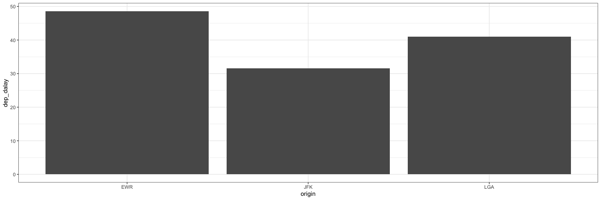
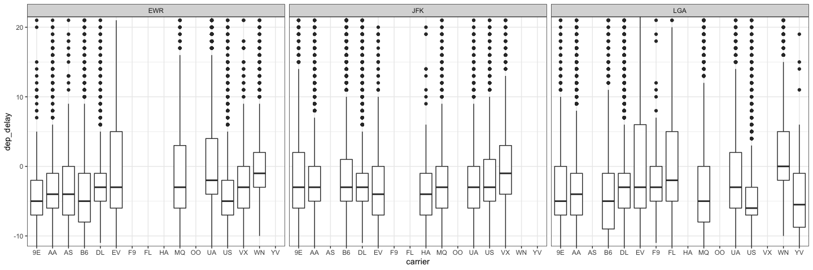

```r
# Use this R-Chunk to import all your datasets!
dat <- nycflights13::flights
dat <- na.omit(dat)
View(dat)
```

## Background

You just started your internship at a big firm in New York, and your manager gave you an extensive file of flights that departed JFK, LGA, or EWR in 2013. From this data (nycflights13::flights), which you can obtain in R (install.packages("nycflights13"); library(nycflights13)), your manager wants you to answer the following questions;


## Data Wrangling


```r
# Use this R-Chunk to clean & wrangle your data!
# Avg delta delay times
avg <- dat %>% 
  subset(carrier == "DL") %>% 
  mutate(delay_pos = dep_delay > 0) %>% 
  subset(delay_pos) %>% 
  group_by(origin) %>% 
  summarise(dep_dalay = mean(dep_delay))
  

View(avg)
```

## Data Visualization


```r
# Use this R-Chunk to plot & visualize your data!
# Which origin airport is best to minimize my chances of a late arrival when I am using Delta Airlines?
avg %>% 
  ggplot(aes(origin, dep_dalay)) +
  geom_col() +
  theme_bw()
```

<!-- -->

```r
# If I am leaving before noon, which two airlines do you recommend at each airport (JFK, LGA, EWR) that will have the lowest delay time at the 75th percentile?
dat %>% 
  filter(sched_dep_time < 1200) %>% 
  ggplot(aes(x = carrier, y = dep_delay)) +
  facet_grid(~origin) +
  geom_boxplot() +
  coord_cartesian(ylim = c(-10, 20)) +
  theme_bw()
```

<!-- -->

## Conclusions

I found that delta was most often late from EWR airport. JFK and LGA had a much lower average departure delay. 

JFK had the lowest 75th percentile of departure delays per carrier. Even their highest 75th percentile delays were the lowest. EWR had the second lowest with a few spikes of departure delays. However, LGA had fewer delays in the 75th percentile than EWR, but the delays were much higher. I would recommend taking the chance on JFK and LGA. 
