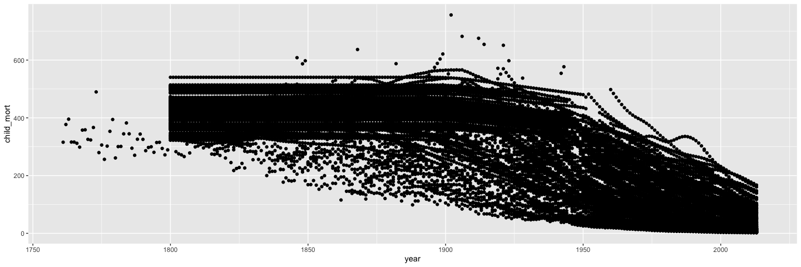
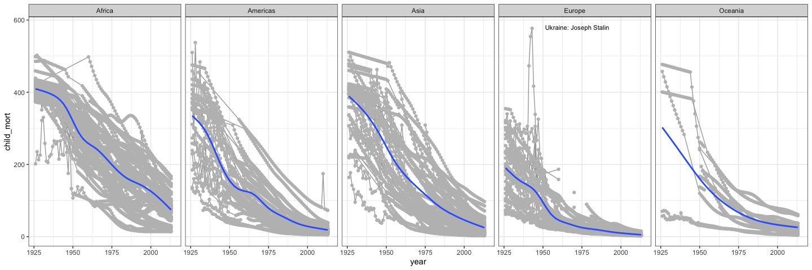

```r
# Use this R-Chunk to import all your datasets!
# need child_mort, health_exp_total, life_expectancy, year, country, continent
dat <- ourworldindata::financing_healthcare %>% 
  as_tibble() %>% 
  select(year, continent, country, child_mort, health_exp_total, life_expectancy)

View(dat)
```

## Background

The Our World in Data website has world data. It is nice that they have provided graphics and then the data that they used to generate the graphics. Once again, we are going to build visualizations in R using their data.

## Reading

Variation - the amount of change in one variable
Covariation - the tendency of multiple variables to variate in similar ways at the same time

"EDA is fundamentally a creative process. And like most creative processes, the key to asking quality questions is to generate a large quantity of questions.
  What type of variation occurs within my variables?
  What type of covariation occurs between my variables?"

## Data Wrangling


```r
# Use this R-Chunk to clean & wrangle your data!
dat %>% 
  ggplot(aes(x = year, y = child_mort)) +
  geom_point()
```

<!-- -->

```r
dat %>% 
  filter(year < 1799) %>% 
  group_by(country) %>% 
  summarize(count = n(), count_na = sum(is.na(child_mort)))
```

```
## # A tibble: 1 x 3
##   country count count_na
##   <chr>   <int>    <int>
## 1 Sweden     38        0
```

```r
dat %>% 
  filter(year < 17850) %>% 
  group_by(country) %>% 
  summarize(count = n(), count_na = sum(is.na(child_mort)))
```

```
## # A tibble: 319 x 3
##    country               count count_na
##    <chr>                 <int>    <int>
##  1 Abkhazia                  1        1
##  2 Afghanistan             211        2
##  3 Akrotiri and Dhekelia     1        1
##  4 Åland Islands             1        1
##  5 Albania                 207       20
##  6 Algeria                 207        2
##  7 American Samoa            1        1
##  8 Andorra                  25        1
##  9 Angola                  215       10
## 10 Anguilla                  1        1
## # … with 309 more rows
```

```r
dat %>% 
  group_by(country, year) %>% 
  summarize(count = n(), count_na = sum(is.na(child_mort)))
```

```
## # A tibble: 36,873 x 4
## # Groups:   country [319]
##    country      year count count_na
##    <chr>       <int> <int>    <int>
##  1 Abkhazia     2015     1        1
##  2 Afghanistan  1800     1        0
##  3 Afghanistan  1801     1        0
##  4 Afghanistan  1802     1        0
##  5 Afghanistan  1803     1        0
##  6 Afghanistan  1804     1        0
##  7 Afghanistan  1805     1        0
##  8 Afghanistan  1806     1        0
##  9 Afghanistan  1807     1        0
## 10 Afghanistan  1808     1        0
## # … with 36,863 more rows
```

```r
dat %>% 
  group_by(year) %>% 
  summarize(count = n(), count_na = sum(is.na(child_mort)))
```

```
## # A tibble: 255 x 3
##     year count count_na
##    <int> <int>    <int>
##  1  1761     1        0
##  2  1762     1        0
##  3  1763     1        0
##  4  1764     1        0
##  5  1765     1        0
##  6  1766     1        0
##  7  1767     1        0
##  8  1768     1        0
##  9  1769     1        0
## 10  1770     1        0
## # … with 245 more rows
```

```r
dat_label <- tibble(continent = c("Africa", "Americas", "Asia", "Europe", "Oceania"), 
                    year = 1942, child_mort = 580, 
                    label = c(NA, NA, NA, "Ukraine: Joseph Stalin", NA))


dat %>%
  filter(year > 1925, !is.na(continent)) %>%
  ggplot(aes(x = year, y = child_mort)) +
  geom_line(aes(group = country), color = "darkgrey") +
  geom_point(color = "grey") +
  facet_wrap(~continent, nrow = 1) +
  theme_bw() +
  geom_smooth(se = FALSE) +
  scale_color_brewer(type = "qual") +
  geom_text(data = dat_label, aes(label = label), 
            size = 3, nudge_x = 30, color = "black")
```

<!-- -->

## Data Visualization


```r
# Use this R-Chunk to plot & visualize your data!
```

## Conclusions

## Checklist
[x] Take notes on your reading of the specified ‘R for Data Science’ chapter in the README.md or in a ‘.R’ script in the class task folder
[x] Explore the world data on financing_healthcare and create an interesting graphic that highlights this dataset in relation to child mortality.
  [x] Use devtools::install_github("drsimonj/ourworldindata") to get a larger dataset on financing_healthcare
  [x] Create a graphic that you could use in a final presentation to summarize world child mortality (child_mort column)
[x] Push your .Rmd, .md, and .html to your GitHub repo
