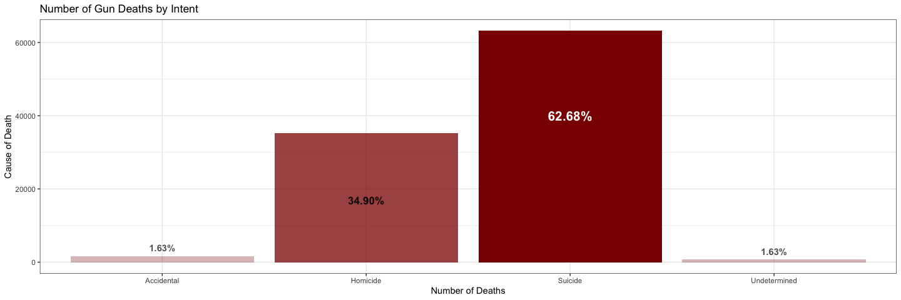
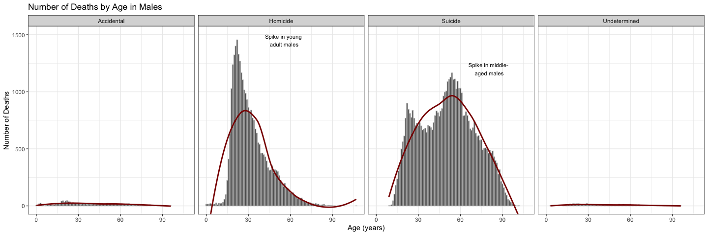
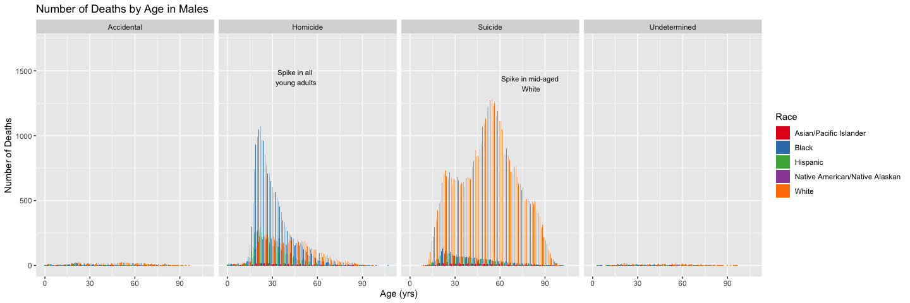

Summary


```r
# Use this R-Chunk to import all your datasets!
dat <- read_csv(url("https://github.com/fivethirtyeight/guns-data/raw/master/full_data.csv"))
View(dat)
```

## Background

The world is a dangerous place. During 2015 and 2016 there was a lot of discussion in the news about police shootings. FiveThirtyEight reported on gun deaths in 2016. As leaders in data journalism, they have posted a clean version of this data in their GitHub repo called full_data.csv for us to use.

While their visualizations focused on yearly averages, our client wants to create commercials that help reduce the gun deaths in the US. They would like to target the commercials in different seasons of the year (think month variable) to audiences that could have the most impact in reducing gun deaths. Our challenge is to summarize and visualize seasonal trends accros the other variables in these data.

## Data Wrangling


```r
# Use this R-Chunk to clean & wrangle your data!
bar_general <- dat %>% 
  filter(!is.na(intent)) %>% 
  group_by(intent) %>% 
  summarise(n = n()) %>% 
  mutate(pct = n / sum(n)) %>% 
  mutate(label = scales::percent(pct))
bar_general
```

```
## # A tibble: 4 x 4
##   intent           n     pct label 
##   <chr>        <int>   <dbl> <chr> 
## 1 Accidental    1639 0.0163  1.63% 
## 2 Homicide     35176 0.349   34.90%
## 3 Suicide      63175 0.627   62.68%
## 4 Undetermined   807 0.00801 0.80%
```

```r
bar_age_male <- dat %>% 
  filter(!is.na(intent), sex == "M") %>% 
  group_by(intent, sex, age) %>% 
  summarise(n = n())
bar_age_male
```

```
## # A tibble: 373 x 4
## # Groups:   intent, sex [4]
##    intent     sex     age     n
##    <chr>      <chr> <dbl> <int>
##  1 Accidental M         0     4
##  2 Accidental M         1     1
##  3 Accidental M         2    18
##  4 Accidental M         3    25
##  5 Accidental M         4    15
##  6 Accidental M         5     5
##  7 Accidental M         6     2
##  8 Accidental M         7     5
##  9 Accidental M         8     9
## 10 Accidental M         9     7
## # … with 363 more rows
```

```r
bar_age_race <- dat %>% 
  filter(!is.na(intent)) %>% 
  group_by(intent, age, race) %>% 
  summarise(n = n())
bar_age_race
```

```
## # A tibble: 1,271 x 4
## # Groups:   intent, age [379]
##    intent       age race                               n
##    <chr>      <dbl> <chr>                          <int>
##  1 Accidental     0 Black                              5
##  2 Accidental     0 Hispanic                           2
##  3 Accidental     0 Native American/Native Alaskan     1
##  4 Accidental     0 White                              3
##  5 Accidental     1 Black                              2
##  6 Accidental     1 Hispanic                           1
##  7 Accidental     1 White                              1
##  8 Accidental     2 Asian/Pacific Islander             1
##  9 Accidental     2 Black                              8
## 10 Accidental     2 Hispanic                           1
## # … with 1,261 more rows
```
## Article Summary
This article is showing how the number one cause of gun deaths is not necessarily what the media likes to portray. There is so much heat on Police Officers and gang violence that we are missing and opportunity to combat 63% of gun deaths! Gun violence is always a tragedy, but based on the rates of suicide, it seems that gun legislation is much more complicated and revolved more around the state of our citizens mental stability than their access to guns. 

## Data Visualization


```r
# Use this R-Chunk to plot & visualize your data!
# Color pallete -> shades of red to show urgency
pal_general <- c(
  "Accidental" = alpha("darkred", .3),
  "Homicide" = alpha("darkred", .75),
  "Suicide" = alpha("darkred", 1),
  "Undetermined" = alpha("darkred", .3)
)

bar_general %>% 
  ggplot(aes(x = intent, y = n, fill = intent)) +
  geom_col() +
  theme_bw() +
  labs(title = "Number of Gun Deaths by Intent", 
       x = "Number of Deaths", y = "Cause of Death") +
  annotate("Text", x = 1,  y = 4000, label = paste(bar_general$label[1]), 
           angle = 0, fontface = "bold", color = alpha("black", .7)) +
  annotate("Text", x = 2,  y = 17000, label = paste(bar_general$label[2]), 
           angle = 0, fontface = "bold", color = alpha("black", .9), size = 4.5) +
  annotate("Text", x = 3,  y = 40000, label = paste(bar_general$label[3]), 
           angle = 0, fontface = "bold", color = "white", size = 5.5) +
  annotate("Text", x = 4,  y = 3000, label = paste(bar_general$label[1]), 
           angle = 0, fontface = "bold", color = alpha("black", .7)) +
  scale_fill_manual(values = pal_general) +
  theme(legend.position = "none")
```

<!-- -->

```r
# Color pallete for the gender
pal_gender <- c(
  "M" = alpha("darkred", 1),
  "F" = alpha("darkred", .7)
)

age_label_suicide <- tibble(intent = c("Accidental", "Homicide", "Suicide", "Undetermined"),
                    age = 50, n = 1200, label = c(NA, NA, "Spike in middle-\n aged males", NA))

age_label_homicide <- tibble(intent = c("Accidental", "Homicide", "Suicide", "Undetermined"),
                    age = 25, n = 1450, label = c(NA, "Spike in young\n adult males", NA, NA))

bar_age_male %>% 
  ggplot(aes(x = age, y = n)) +
  geom_col(color = alpha("gray", .7)) +
  facet_grid(~intent) +
  geom_smooth(se = FALSE, color = alpha("darkred")) +
  coord_cartesian(ylim = c(0:1500)) +
  labs(title = "Number of Deaths by Age in Males",
      x = "Age (years)", y = "Number of Deaths") +
  theme_bw() +
  geom_text(data = age_label_suicide, aes(label = label), size = 3, 
            nudge_x = 30, color = "black") +
  geom_text(data = age_label_homicide, aes(label = label), size = 3, 
            nudge_x = 30, color = "black")
```

<!-- -->

```r
age_label_white <- tibble(intent = c("Accidental", "Homicide", "Suicide", "Undetermined"),
                    age = 50, n = 1400, label = c(NA, NA, "Spike in mid-aged\n White", NA))
age_label_black <- tibble(intent = c("Accidental", "Homicide", "Suicide", "Undetermined"),
                    age = 15, n = 1450, label = c(NA, "Spike in all\n young adults", NA, NA))


bar_age_race %>% 
  ggplot(aes(x = age, y = n)) +
  geom_col(aes(fill = race), position = "dodge") +
  scale_fill_brewer(palette = "Set1") +
  facet_grid(~intent) +
  coord_cartesian(ylim = c(0:1700)) +
  labs(title = "Number of Deaths by Age in Males",
      x = "Age (yrs)", y = "Number of Deaths", fill = "Race") +
  geom_text(data = age_label_white, aes(label = label), size = 3, 
            nudge_x = 30, color = "black") +
  geom_text(data = age_label_black, aes(label = label), size = 3, 
            nudge_x = 30, color = "black")
```

<!-- -->

## Conclusions
My second image is number of deaths in males per year of age. The shocking value that is addressed in the 538 article is that of the spike in suicide rates of middle-aged males. Suicides, being by far the largest share of gun deaths, is then made up of mostly middle-aged men. The following graphic breaks up all of the deaths in races. We see that homicides are committed majorly by young-adults of all races, and that suicides are vastly commited by whites. 


