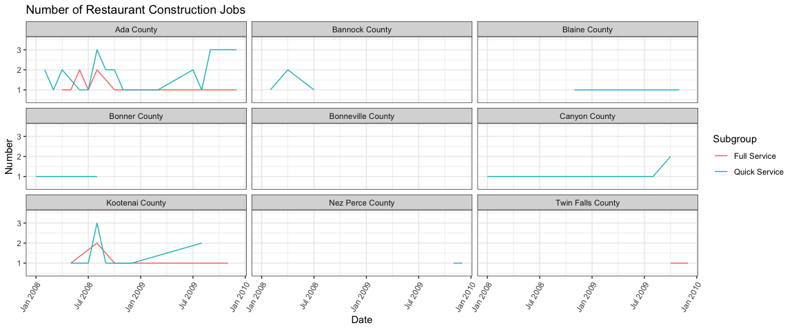
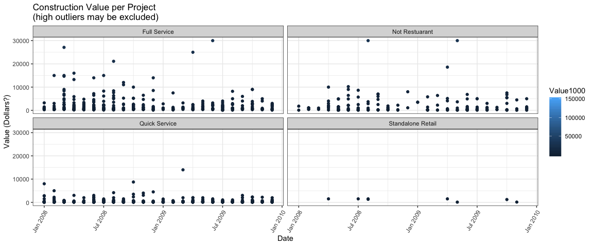
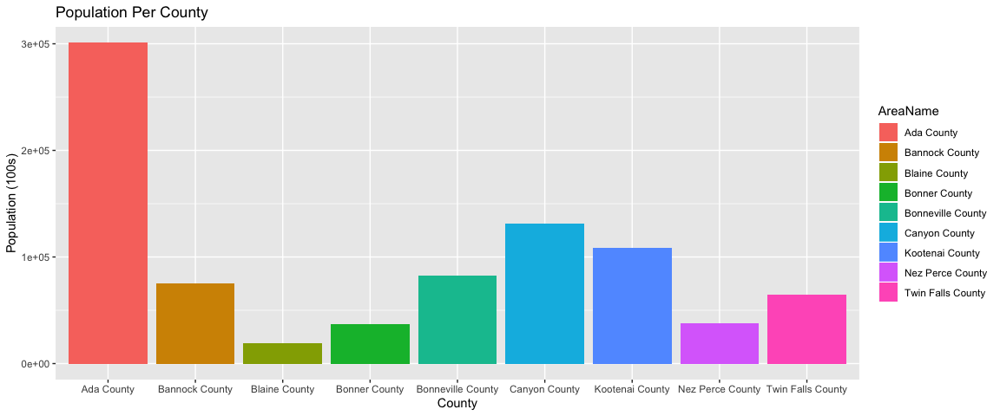

```r
# Use this R-Chunk to import all your datasets!
restaurants <- buildings::restaurants %>% as_tibble()
dat <- buildings::buildings0809 %>% 
  full_join(buildings::climate_zone_fips, by = c("FIPS.county", "FIPS.state")) 
```

## Background

It is 2010, and you are working for the Idaho restaurant commission, and they need your help getting a clearer picture of how restaurant construction changed across Idaho from 2008 to 2009. They provided you a dataset of all commercial construction in Idaho for those two years. The data has a variable Type with a general category called Food_Beverage_Service that has other buildings besides restaurants in the category. You will need to use the restaurant names (see restaurants data object) and some additional key words to create the correct subgroupings. Your client expects to provide new data for 2010 and 2011 so your script needs to do the work. Make sure you do not use Excel to manipulate anything.

How did full-service restaurant construction compare to quick service restaurant construction across county and years?
How did restaurant construction fare compare to the other commercial construction in Idaho?
Which county in Idaho spent the most on fast food construction each year?
In that county how did other commercial construction compare?
## Data Wrangling


```r
# Use this R-Chunk to clean & wrangle your data!
# lowercase all project titles and trim bad white space
dat$ProjectTitle <- dat$ProjectTitle %>% 
  str_to_lower() %>% 
  str_trim() %>% 
  str_remove_all("[']") %>% 
  str_remove_all("[.]") %>% 
  str_replace_all("[-]", " ")

# lowercase all restuarant names and make some consistency
restaurants$Restaurant <- restaurants$Restaurant %>% 
  str_to_lower() %>% 
  str_trim() %>% 
  str_remove_all("[']") %>% 
  str_remove_all("[.]") %>% 
  str_replace_all("[-]", " ")

# remove duplicates, if possible to detect
restaurants <- restaurants %>% distinct()

# standardize our groupings
# collapse with "|" to provide an OR in regex (thanks to Sister Young for idea)
not_restaurants <- c("development","Food preperation center", "Food Services center","bakery","Grocery","conceession","Cafeteria", "lunchroom","school","facility"," hall ") %>% 
  str_to_lower() %>% 
  str_trim() %>% 
  str_c(collapse = "|")

standalone_retail <- c("Wine","Spirits","Liquor","Convenience","drugstore","Flying J", "Rite Aid ","walgreens ","Love's Travel ") %>% 
  str_to_lower() %>% 
  str_trim() %>% 
  str_c(collapse = "|")

full_service_type <- c("Ristorante","mexican","pizza ","steakhouse"," grill ","buffet","tavern"," bar ","waffle","italian","steak house") %>% 
  str_to_lower() %>% 
  str_trim() %>% 
  str_c(collapse = "|")

quick_service_type <- c("coffee"," java "," Donut ","Doughnut"," burger ","Ice Cream ","custard ","sandwich ","fast food "," bagel ") %>% 
  str_to_lower() %>% 
  str_trim() %>% 
  str_c(collapse = "|")

quick_service_names <- restaurants$Restaurant[restaurants$Type %in% c("coffee","Ice Cream","Fast Food")] %>% 
  str_to_lower() %>% 
  str_trim() %>% 
  str_c(collapse = "|")

full_service_names <- restaurants$Restaurant[restaurants$Type %in% c("Pizza","Casual Dining","Fast Casual")] %>% 
  str_to_lower() %>% 
  str_trim() %>% 
  str_c(collapse = "|")

# Detect the presence of the above conditions to determine type of construction project
dat <- dat %>% 
  mutate(Subgroup = case_when(
    str_detect(ProjectTitle, full_service_names) |
    str_detect(ProjectTitle, full_service_type) ~ "Full Service",
    str_detect(ProjectTitle, quick_service_names) |
    str_detect(ProjectTitle, quick_service_type) ~ "Quick Service",
    str_detect(ProjectTitle, not_restaurants) ~ "Not Restuarant",
    str_detect(ProjectTitle, standalone_retail) ~ "Standalone Retail",
    SqFt >= 4000 ~ "Full Service",
    SqFt < 4000 ~"Quick Service",
    TRUE~"Undetermined"
  )) %>% 
  mutate(Date = as.yearmon(paste(Year, Month), "%Y %m"))
```

## Data Visualization


```r
# Use this R-Chunk to plot & visualize your data!
dat %>% 
  filter(Subgroup == "Full Service" | Subgroup == "Quick Service") %>% 
  filter(Type == "Food_Beverage_Service") %>% 
  group_by(Subgroup, Date, AreaName) %>% 
  summarize(n = n()) %>% 
  ggplot(aes(x = Date, y = n, color = Subgroup), position = "dodge") +
  geom_path() +
  facet_wrap(~AreaName, nrow = 3) +
  theme_bw() +
  theme(axis.text.x = element_text(angle = 60, hjust = 1)) +
  labs(title = "Number of Restaurant Construction Jobs",
       x = "Date", y = "Number") +
  coord_cartesian(ylim = c(0.5,3.5))
```

<!-- -->

```r
dat %>% 
  filter(Subgroup != "Undetermined") %>% 
  ggplot(aes(x = Date, y = Value1000, color = Value1000)) +
  geom_point() +
  #geom_histogram(stat = "identity", position = "dodge2") +
  facet_wrap(~Subgroup) +
  theme_bw() +
  theme(axis.text.x = element_text(angle = 60, hjust = 1)) +
  labs(title = "Construction Value per Project\n(high outliers may be excluded)",
       x = "Date", y = "Value (Dollars?)") +
  coord_cartesian(ylim = c(0, 30000))
```

<!-- -->

```r
dat %>% 
  filter(Subgroup == "Full Service" | Subgroup == "Quick Service") %>% 
  filter(Type == "Food_Beverage_Service") %>% 
  group_by(AreaName, Pop100, Date) %>% 
  summarize() %>% 
  ggplot(aes(x = AreaName, y = Pop100, fill = AreaName)) +
  geom_col(stat = "identity", position = "dodge") +
  scale_y_continuous() +
  labs(title = "Population Per County", x = "County", y = "Population (100s)")
```

<!-- -->

## Conclusions
My first graph comparing the number of restaurant construction jobs in each Idaho County shows that Ada County is obviously the most active with a higher demand for quick service restaurants. Similarly, it is very rare for any county to have a higher number of quick service restaurant jobs than full service restaurant jobs, except for Twin Falls county. 
My second plot shows the value of each construction project in the given time period, with some very high outliers excluded. It is clear to see that restaurant construction outnumbers other commercial construction types, as well as outvalues them.
Finally, for some context, I have presented the populations of each of the counties with restaurant constructions. 

