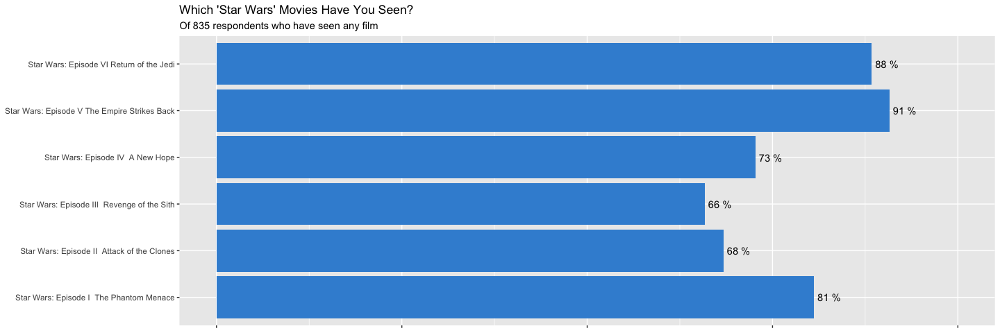
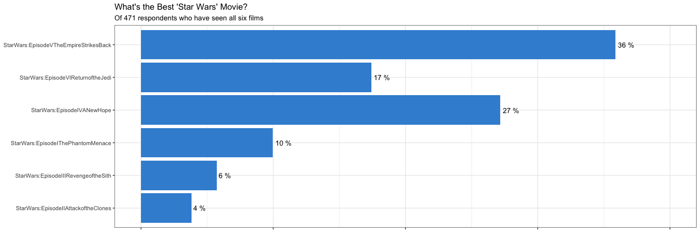

```r
# Use this R-Chunk to import all your datasets!
dat_multiresponse <- read_csv("https://github.com/byuidatascience/data_fivethirtyeight_starwars/raw/master/survey_multiresponse_questions.csv")
dat_singleresponse <- read_csv("https://github.com/byuidatascience/data_fivethirtyeight_starwars/raw/master/survey_oneresponse_questions.csv")
dat_wideall <- read_csv("https://github.com/byuidatascience/data_fivethirtyeight_starwars/raw/master/survey_wide_all.csv")
```

## Background

_Place Task Background Here_

## Data Wrangling


```r
# Use this R-Chunk to clean & wrangle your data!
```

## Data Visualization


```r
# Use this R-Chunk to plot & visualize your data!
which_seen <- dat_multiresponse %>% 
  filter(question == "which_seen") %>% 
  drop_na(answer) %>% 
  group_by(answer) %>% 
  summarise(n = n()) %>% 
  mutate(n = n / 835)

which_seen %>% 
  ggplot(aes(x = answer, y = n)) +
  geom_bar(stat = "identity", fill = "#3C90D6") +
  scale_y_continuous(labels = scales::percent) +
  geom_text(aes(label = paste(round((n * 100), 0),"%")), 
            position = position_dodge(width = 0.9), hjust = -0.15) +
  coord_flip(ylim = c(0, 1)) +
  labs(title = "Which 'Star Wars' Movies Have You Seen?",
       subtitle = "Of 835 respondents who have seen any film") +
  theme(axis.title.x = element_blank(),
        axis.title.y = element_blank(),
        axis.text.x = element_blank())
```

<!-- -->

```r
# Filter to #1 best movies
best_swmovie <- dat_multiresponse %>% 
  group_by(question, choice) %>% 
  filter(question == "which_seen") %>% 
  pivot_wider(id_cols = respondentid, names_from = choice, values_from = answer) %>% 
  drop_na() %>% 
  select(respondentid) %>% 
  left_join(dat_multiresponse) %>% 
  filter(question == "rank_1f6w", answer == "1") 

best_swmovie %>% 
  group_by(choice) %>% 
  summarize(n = n()) %>% 
  mutate(n = n / sum(n)) %>% 
  ggplot(aes(x = choice, y = n)) +
  geom_bar(stat = "identity", fill = "#3C90D6", width = ) +
  scale_y_continuous(labels = scales::percent) +
  geom_text(aes(label = paste(round((n * 100), 0),"%")), 
            position = position_dodge(width = 0.9), hjust = -0.15) +
  coord_flip(ylim = c(0, .4)) +
  theme_bw() +
  labs(title = "What's the Best 'Star Wars' Movie?",
       subtitle = "Of 471 respondents who have seen all six films") +
  theme(axis.title.x = element_blank(),
        axis.title.y = element_blank(),
        axis.text.x = element_blank())
```

<!-- -->

```r
here()
```

```
## [1] "/Users/CritterWilson/Documents/BYU-I/Software Engineering/MATH335/M335_WI20_Wilson_Chri"
```

## Conclusions
