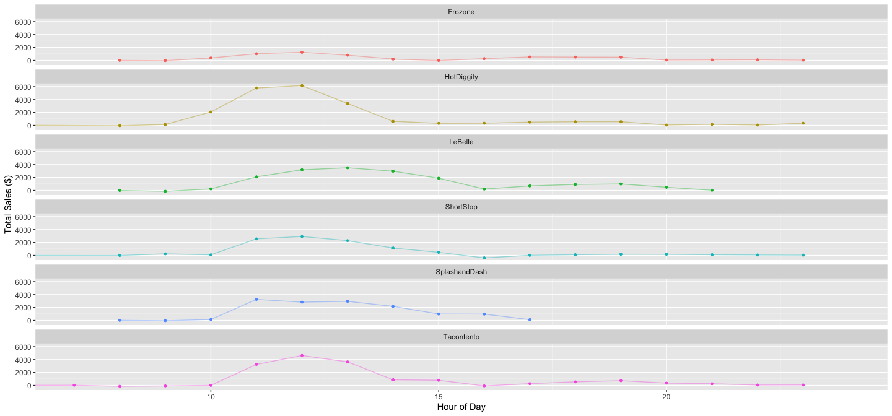
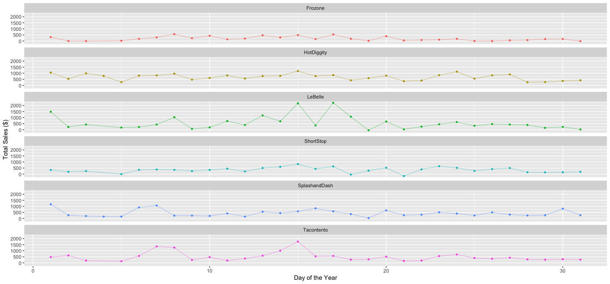
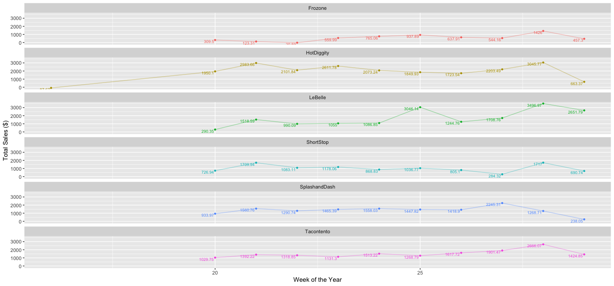
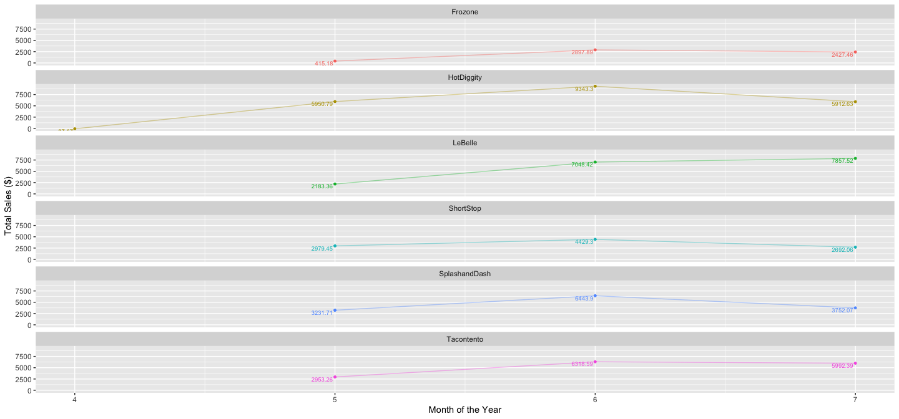

```r
# Use this R-Chunk to import all your datasets!
dat <- read_csv("https://byuistats.github.io/M335/data/sales.csv") %>% 
  with_tz("America/Denver") %>%
  filter(Name != "Missing") %>% 
  mutate(day = day(Time)) %>% 
  mutate(week = week(Time)) %>% 
  mutate(month = month(Time))
```

## Background

_Place Task Background Here_

## Data Wrangling


```r
# Use this R-Chunk to clean & wrangle your data!
dat_Tacontento <- dat %>% filter(Name == "Tacontento")
dat_SplashandDash <- dat %>% filter(Name == "SplashandDash")
dat_ShortStop <- dat %>% filter(Name == "ShortStop")
dat_LeBelle <- dat %>% filter(Name == "LeBelle")
dat_HotDiggity <- dat %>% filter(Name == "HotDiggity")
dat_Frozone <- dat %>% filter(Name == "Frozone")
dat_Missing <- dat %>% filter(Name == "Missing")
```

## Data Visualization


```r
# Use this R-Chunk to plot & visualize your data!
# Hourly Totals
dat %>% 
  mutate(Hour = floor_date(Time, unit = "hour") %>% hour()) %>% 
  group_by(Name, Hour, Type) %>% 
  summarise(Amount = sum(Amount)) %>% 
  ggplot(aes(x = Hour, y = Amount, color = Name)) +
  geom_line(alpha = 0.4) +
  geom_point(size = 1) +
  labs(x = "Hour of Day", y = "Total Sales ($)",
       Title = "Sales Per Hour") +
  facet_wrap(~Type, ncol = 1) +
  coord_cartesian(xlim = c(7, 24)) +
  facet_wrap(~Name, ncol = 1) +
  theme(legend.position = "none")
```

<!-- -->

```r
#Daily Totals
dat %>% 
  mutate(Day = day(Time)) %>% 
  group_by(Name, Day, Type) %>% 
  summarize(Amount = sum(Amount)) %>% 
  ggplot(aes(x = Day, y = Amount, color = Name)) +
  geom_line(alpha = .4) +
  geom_point(size = 1) +
  labs(x = "Day of the Year", y = "Total Sales ($)",
       Title = "Sales Per Day") +
  facet_wrap(~Name, ncol = 1) +
  theme(legend.position = "none")
```

<!-- -->

```r
# Weekly Totals
dat %>% 
  mutate(Week = week(Time)) %>% 
  group_by(Name, Week, Type) %>% 
  summarize(Amount = sum(Amount)) %>% 
  ggplot(aes(x = Week, y = Amount, color = Name)) +
  geom_line(alpha = .4) +
  geom_point(size = 1) +
  labs(x = "Week of the Year", y = "Total Sales ($)",
       Title = "Sales Per Week") +
  geom_text(aes(label = Amount),hjust = 1.1, vjust = 1, size = 2.5) +
  facet_wrap(~Name, ncol = 1) +
  theme(legend.position = "none")
```

<!-- -->

```r
# Monthly rates
dat %>% 
  mutate(Month = month(Time)) %>% 
  group_by(Name, Month, Type) %>% 
  summarize(Amount = sum(Amount)) %>% 
  ggplot(aes(x = Month, y = Amount, color = Name)) +
  geom_line(alpha = .4) +
  geom_point(size = 1) +
  geom_text(aes(label = Amount),hjust = 1.1, vjust = 1, size = 2.5) +
  labs(x = "Month of the Year", y = "Total Sales ($)",
       Title = "Sales Per Month") +
  facet_wrap(~Name, ncol = 1) +
  theme(legend.position = "none")
```

<!-- -->

## Conclusions
