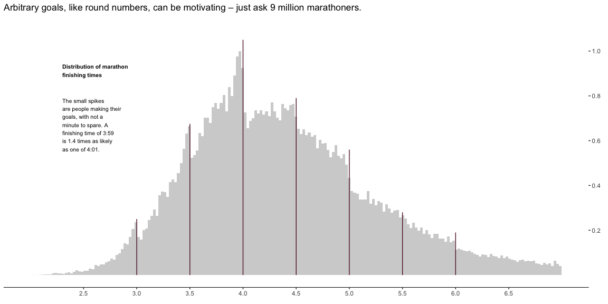

```r
# Use this R-Chunk to import all your datasets!
dat <- read_csv("https://byuistats.github.io/M335/data/runners_100k.csv")
```

## Background

_Place Task Background Here_

## Data Wrangling


```r
# Use this R-Chunk to clean & wrangle your data!
chiptimes <- dat %>% 
  # Sample 10,000 so we can work faster (especially w/ zoom running)
  #sample_n(100000, replace = TRUE) %>% 
  # We only care about the chip time (see comment at top)
  select(chiptime) %>% 
  # Google says fastest marathon time ever is 2:02:57, anything less is error
  filter(chiptime > 2) %>% 
  # convert to decimal
  mutate(chiptime = as.numeric(chiptime / 60))
```

## Data Visualization


```r
# Use this R-Chunk to plot & visualize your data!
# Custom Text Annotations
grob1 <- grobTree(textGrob("Distribution of marathon\nfinishing times", x=0.1,  y=0.8, hjust=0,
                           gp=gpar(col="black", fontsize=8, fontface="bold")))
grob2 <- grobTree(textGrob("The small spikes\nare people making their\ngoals, with not a\nminute to spare. A\nfinishing time of 3:59\nis 1.4 times as likely\nas one of 4:01.", 
                           x=0.1,  y=0.6, hjust=0, gp=gpar(col="black", fontsize=8)))


chiptimes %>% 
  ggplot(aes(x = chiptime, y = ..ncount..)) +
  geom_histogram(alpha = 0.3, bins = 200) +
  scale_y_continuous(position = "right", limits = c(0, 1.1), breaks = seq(0.2, 1.0, by = 0.2)) +
  scale_x_continuous(limits = c(2, 7), breaks = seq(2.5, 6.5, by = 0.5)) +
  labs(title = "Arbitrary goals, like round numbers, can be motivating – just ask 9 million marathoners.",
       x = element_blank(), y = element_blank()) +
  annotation_custom(grob1) +
  annotation_custom(grob2) +
  annotate("segment", x = 3, xend = 3, y = 0, yend = 0.25, color = "#5D1733") +
  annotate("segment", x = 3.5, xend = 3.5, y = 0, yend = 0.675, color = "#5D1733") +
  annotate("segment", x = 4, xend = 4, y = 0, yend = 1.05, color = "#5D1733") +
  annotate("segment", x = 4.5, xend = 4.5, y = 0, yend = 0.79, color = "#5D1733") +
  annotate("segment", x = 5, xend = 5, y = 0, yend = 0.56, color = "#5D1733") +
  annotate("segment", x = 5.5, xend = 5.5, y = 0, yend = 0.28, color = "#5D1733") +
  annotate("segment", x = 6, xend = 6, y = 0, yend = 0.19, color = "#5D1733") +
  theme_bw() +
  theme(axis.line.x = element_line(colour = "black"),
        panel.grid.major = element_blank(),
        panel.grid.minor = element_blank(),
        panel.border = element_blank(),
        panel.background = element_blank()) 
```

<!-- -->

## Conclusions
